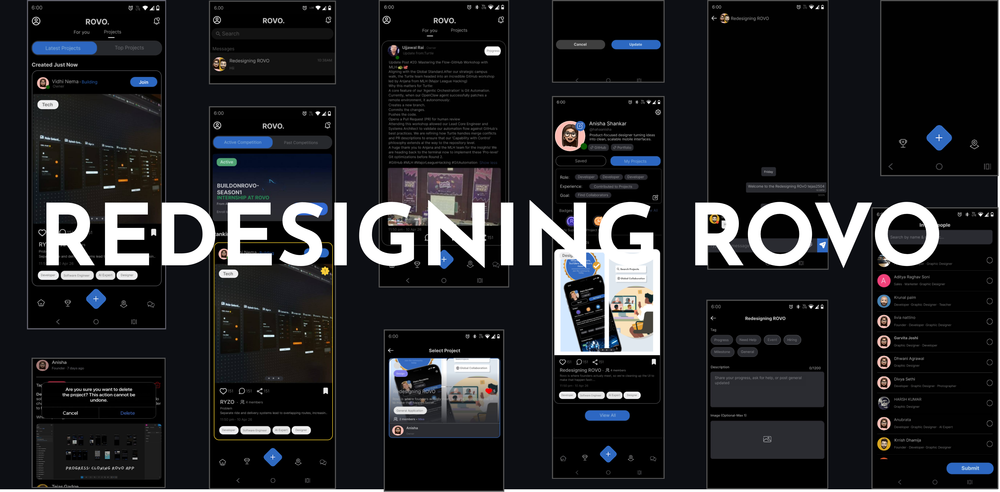
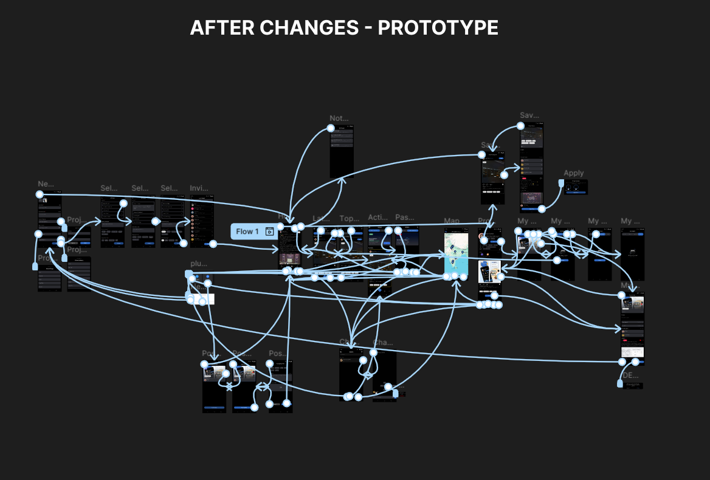
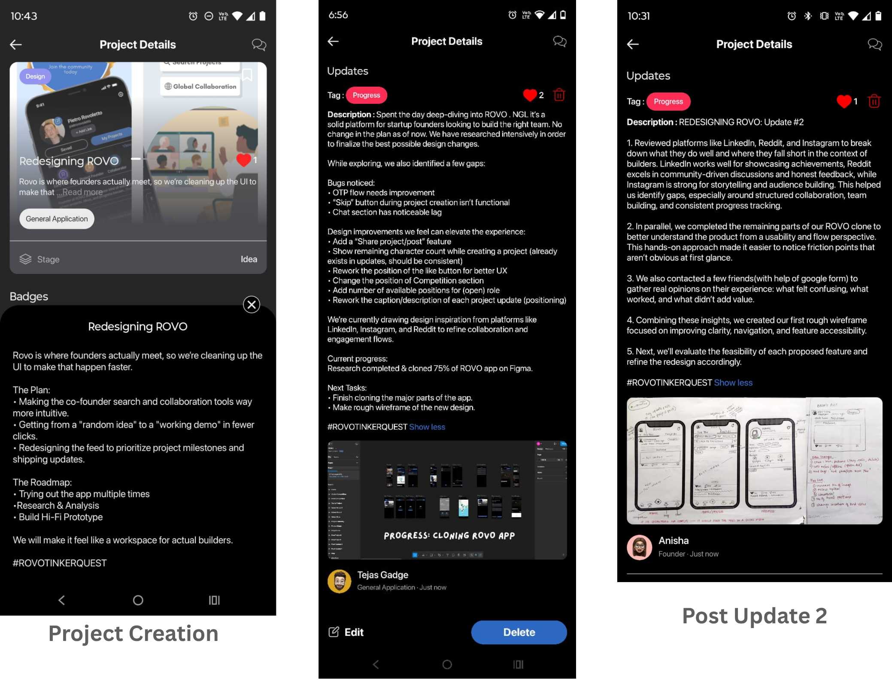
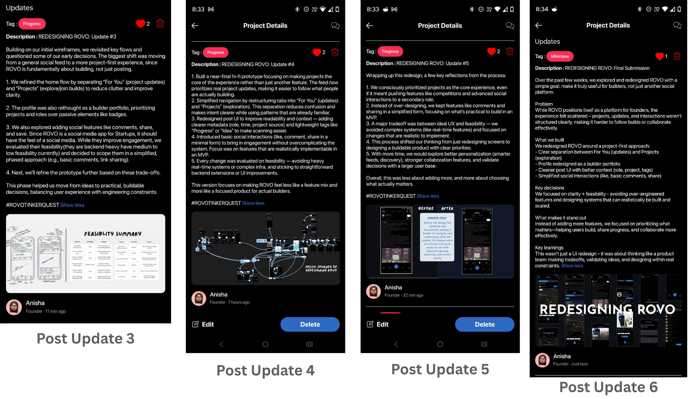

# ROVO Redesign – TinkerQuest'26

  

## Links

- 🎥 **Demo Video:** [Link](https://www.youtube.com/shorts/pC21iXCQCZA)
- 🎨 **Before Changes Prototype:** [Link](https://www.figma.com/proto/ltprGunhWzfskEJHjeiCtU/ROVO?node-id=175-521&t=9yG2mOn8A9NSpHAN-0&scaling=min-zoom&content-scaling=fixed&page-id=0%3A1&hide-ui=1)
- 🎨 **After Changes Prototype:** [Link](https://www.figma.com/proto/ltprGunhWzfskEJHjeiCtU/ROVO?node-id=179-1286&t=9yG2mOn8A9NSpHAN-0&scaling=min-zoom&content-scaling=fixed&page-id=121%3A2&starting-point-node-id=179%3A1286&hide-ui=1)
- 📄 **Design Doc:** [Link](https://docs.google.com/document/d/1vhiuI5fzXWbpbh83IaWWaEX103mZ66pI-iKhujgn2bs/edit?usp=sharing)

---
## Overview

This project is a UX redesign of the ROVO app, created as part of TinkerQuest'26. ROVO positions itself as a platform for builders and founders to collaborate, share progress, and build startups in public.

The goal of this redesign was to improve clarity, usability, and alignment with the core idea of "building in public," while ensuring that the proposed changes are practical and feasible to implement.

---

## Problem Statement

While exploring the existing ROVO app, a few key issues were identified:

- Lack of clear structure between projects and posts
- Difficulty in understanding what to do next as a user
- Limited focus on actual project-building workflows
- Profile did not effectively represent a builder's work
- Missing or weak engagement features

Overall, the experience felt like a mix of features rather than a focused product for builders.

---

## Solution

The redesign focuses on making **projects the core unit** of the platform.

Key improvements include:

- **Project-first feed:** "For You" shows only project updates (latest first)
- **Dedicated Projects tab:** Explore and view projects separately
- **Improved navigation:** Simplified top and bottom navigation for clarity
- **Redesigned post UI:** Better context with role, project name, tags (Progress, Idea, etc.)
- **Profile as a portfolio:** Highlights projects, roles, and contributions instead of just badges
- **Lightweight social features:** Like, basic comments, and share (kept simple for feasibility)

---

## Design Decisions & Tradeoffs

- Prioritized projects over competitions to align with the core purpose
- Avoided complex features like real-time systems or advanced interactions
- Introduced social features in a minimal, scalable form
- Focused on clarity and usability over adding more features

All decisions were evaluated based on whether they could realistically be implemented in an MVP.

---

## Feasibility Considerations

- UI and navigation changes are straightforward to implement
- Project-based structure requires moderate backend support (routing, data models)
- Tags, comments, and sharing are designed in simplified forms
- Complex systems (real-time presence, advanced chat, etc.) were intentionally avoided

The redesign emphasizes **buildable solutions** rather than ideal but impractical ones.

---

## Process

1. Explored the ROVO app in depth (hands-on usage)
2. Studied platforms like LinkedIn, Reddit, and Instagram
3. Collected user feedback through forms and discussions
4. Created initial wireframes based on insights
5. Iterated designs with feasibility in mind
6. Built a high-fidelity prototype

---

## Prototype

  

The final prototype demonstrates the redesigned experience, focusing on:

- Clear user flows
- Better content hierarchy
- Improved discoverability
- Project-centric interactions

---

## Tech Stack

| Area     | Tool         |
|----------|--------------|
| Design   | Figma        |
| Research | Google Forms |

---

## Future Improvements

With more time, the following can be explored:

- Personalized feeds and smarter recommendations
- Advanced collaboration tools within projects
- Better onboarding for new users
- Expanded engagement features (threaded comments, notifications)

---

## Learnings

This project helped shift the focus from just designing screens to thinking about:

- Product decisions and prioritization
- Balancing UX with engineering feasibility
- Designing for real users and real constraints

---
## ROVO POSTS:

  

  

---
## Team INSPIRE

  

### Developed By

| Name | GitHub |
|------|--------|
| Tejas Gadge | [@tejasgadge2504](https://github.com/tejasgadge2504) |
| Anisha Shankar | [@hahaanisha](https://github.com/hahaanisha) |
